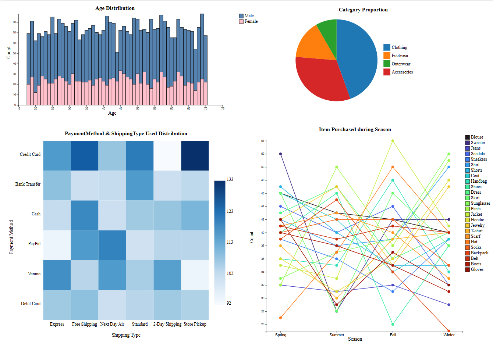

# 客戶⾏為視覺化：數據驅動業務決策

使用 D3.js 分析與視覺化不同客群的購物行為，以協助商家做出更有效的數據導向決策。

## 專案簡介
本專案透過一組包含約 3900 位顧客購物資訊的資料集，探討不同年齡層、性別顧客的購買行為模式，並分析購買品項、支付方式、配送方式以及不同季節的熱門商品等。希望藉由互動式視覺化，協助商家快速觀察並做出行銷與庫存管理的調整。

## 功能
1. **堆疊直方圖 (Stacked Histogram)**
   - 展示不同年齡區間的購買人數，並可區分男性與女性的購買佔比。支援框選 (Brush) 功能，可縮小篩選範圍。

2. **圓餅圖 (Pie Chart)**
   - 顯示各大類別（如 Clothing、Footwear、Outerwear、Accessories）購買量佔比，並可在圖例上點擊篩選。

3. **熱圖 (Heatmap)**
   - 分析消費者常用的支付方式與配送方式組合。以色彩深淺顯示不同組合的使用次數。

4. **折線圖 (Line Chart)**
   - 觀察各商品在不同季節 (Spring, Summer, Fall, Winter) 的銷售趨勢，了解隨季節變化的熱賣品項。

## 互動方式

- **堆疊直方圖**：滑鼠拖拉可框選年齡範圍；點擊圖例「Male 或 Female」可切換顯示方式。
- **圓餅圖**：點擊圖例可針對指定類別篩選，其他圖表對應更新。
- **熱圖**：顯示不同支付方式與物流方式交叉的使用程度。
- **折線圖**：顯示品項在四季的銷售變化，滑鼠移動到資料點可浮出提示 (Tooltip)。

## 資料來源
- [Kaggle - Customer Shopping Trends Dataset](https://www.kaggle.com/datasets/iamsouravbanerjee/customer-shopping-trends-dataset)
- 檔案說明：
  - `shopping_trends.csv`：原始數據
  - `preprocessed_shopping_trends.csv`：預處理過的數據，包含清理及資料型別轉換等作業

## 專案結構

- **index.html**：主頁面，載入並顯示 D3.js 視覺化結果  
- **main.js**：包含 D3.js 的圖表繪製邏輯，包括堆疊直方圖、圓餅圖、熱圖與折線圖  
- **pre_processing.ipynb**：資料預處理的 Python 筆記本 (清理、轉換、篩選、統計等)  
- **data資料夾**：放置原始及預處理後的 CSV 檔  

## 使用技術
- **D3.js** (版本 v5)
- **HTML / CSS / JavaScript**
- **Python** (資料預處理)